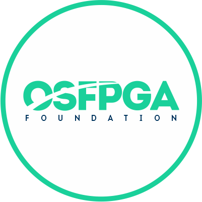

# FOEDAG 

[](https://github.com/os-fpga/FOEDAG/actions/workflows/main.yml)
[](https://foedag.readthedocs.io/en/latest/?badge=latest)
[](https://codecov.io/gh/os-fpga/FOEDAG)

FOEDAG denotes Qt-based Framework Open EDA Gui

## Documentation

FOEDAG's [full documentation](https://foedag.readthedocs.io/en/latest/) includes tutorials, tool options and contributor guidelines.

## Build instructions

Read [`INSTALL`](INSTALL.md) for more details

```bash
  make
or
  make debug
or
  make release_no_tcmalloc (For no tcmalloc)
  
make install (/usr/local/bin and /usr/local/lib/foedag by default which requires sudo privilege,
             use PREFIX= for alternative locations.)
```
> [!NOTE]
> Default WebEngine based editor, Monaco is not supported on WSL and DOCKER. Use the flag as shown below to revert to Qt based editor, QScintilla.
```bash
make MONACO_EDITOR=0 #Refer the Makefile for usage
```
