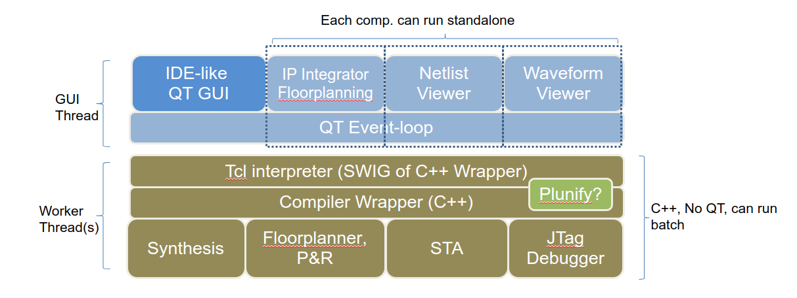

Technical Highlights
--------------------

FOEDAG QT & Tcl based framework is a classic framework found in commercial EDA tools.
All GUI and Terminal commands are executed as Tcl commands, and can be replayable in scripts.
All commands support Undo/Redo with a stack of previous commands.
The GUI thread ensures constant refresh, while the worker thread(s) perform the tasks and run the Tcl interpreter.
The backend part of the tool can be run headless with no GUI.
Each main widget component can be swaped with non-open source variants.
Each main widget component can be executed separately in mini-main to guaranty minimum dependancy.
All main GUI Design Patterns are observed: Model-View-Controller DP, Command DP, Listener DP.

.. _fig_foedag_gui_arch:

  A project under OSFPGA foundation

